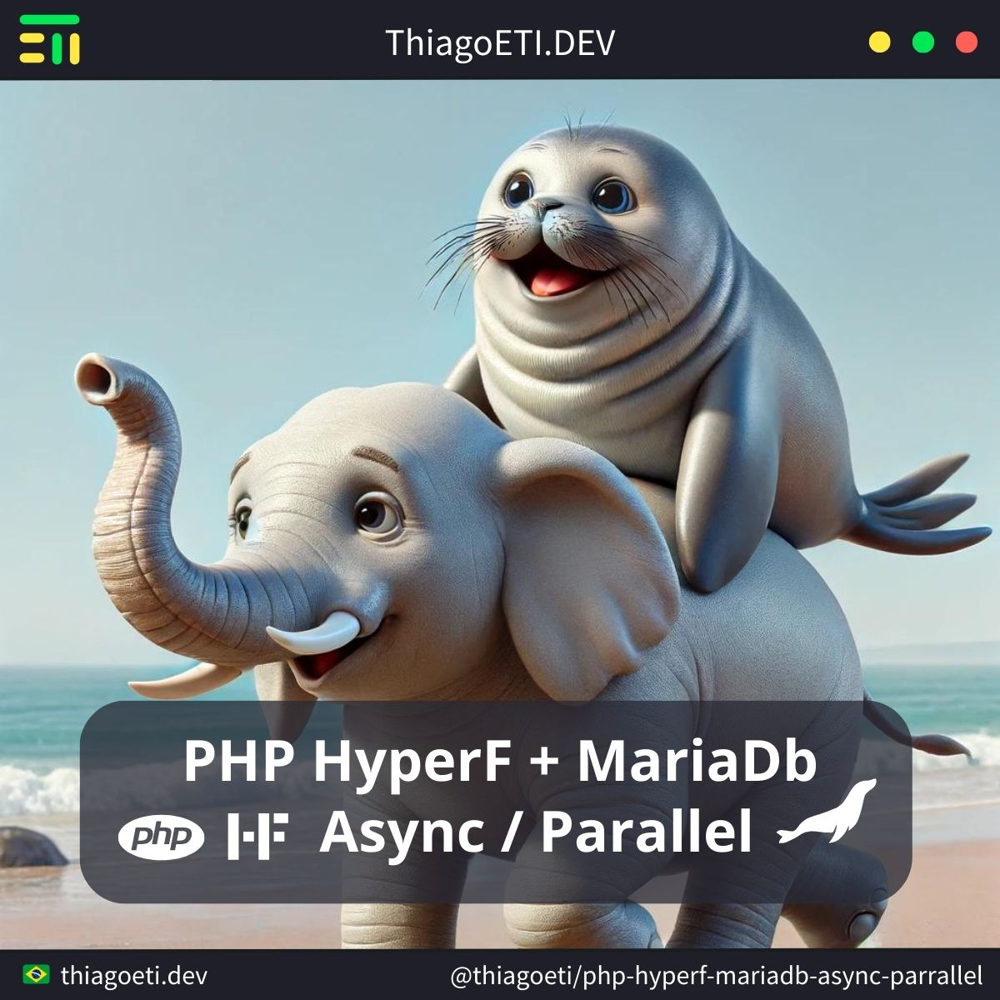

# PHP HyperF + MariaDB -> Async / Parallel

- PHP: 8.3.7
- PHP HyperF: 3.1.23
- MariaDB: 11.3.2



## HyperF - Project

System test for executing database queries in parallel or asynchronously.

#### Create - Project

```console
composer create-project hyperf/hyperf-skeleton "project"
```

#### Install - Watcher

```console
composer require hyperf/watcher --dev
```

#### Install - DB Library

```console
composer require hyperf/database
composer require hyperf/db-connection
```

#### Server - Start

```console
cd project ;
php bin/hyperf.php server:watch ;
```

## MariaDB - Database

The data model is in meta tables, just for example.

#### Database - Project

```sql
CREATE DATABASE `project`;
```

#### Table - Family

```sql
CREATE TABLE `family` (
	`id` tinyint(3) unsigned NOT NULL,
	`name` varchar(40) DEFAULT NULL,
	PRIMARY KEY (`id`)
) ENGINE=InnoDB DEFAULT CHARSET=utf8;
```

#### Table - Pets

```sql
CREATE TABLE `pet` (
	`id` tinyint(3) unsigned NOT NULL,
	`name` varchar(40) DEFAULT NULL,
	PRIMARY KEY (`id`)
) ENGINE=InnoDB DEFAULT CHARSET=utf8;
```

#### Table - Car

```sql
CREATE TABLE `car` (
	`id` tinyint(3) unsigned NOT NULL,
	`name` varchar(40) DEFAULT NULL,
	PRIMARY KEY (`id`)
) ENGINE=InnoDB DEFAULT CHARSET=utf8;
```

#### Table - Family Setting

```sql
CREATE TABLE `family_setting` (
	`id_family` tinyint(3) unsigned NOT NULL,
	`type` varchar(10) DEFAULT NULL,
	`key` tinyint(3) unsigned NOT NULL,
	KEY (`id_family`),
	KEY (`type`),
	KEY (`key`)
) ENGINE=InnoDB DEFAULT CHARSET=utf8;
```

#### Populate - ALL 

```sql
INSERT INTO `family` (`id`, `name`) VALUES(1, 'Family 1');
INSERT INTO `family` (`id`, `name`) VALUES(2, 'Family 2');
INSERT INTO `family` (`id`, `name`) VALUES(3, 'Family 3');

INSERT INTO `pet` (`id`, `name`) VALUES(1, 'Pet 1');
INSERT INTO `pet` (`id`, `name`) VALUES(2, 'Pet 2');
INSERT INTO `pet` (`id`, `name`) VALUES(3, 'Pet 3');

INSERT INTO `car` (`id`, `name`) VALUES(1, 'Car 1');
INSERT INTO `car` (`id`, `name`) VALUES(2, 'Car 2');
INSERT INTO `car` (`id`, `name`) VALUES(3, 'Car 3');

INSERT INTO `family_setting` (`id_family`, `type`, `key`) VALUES(1, 'pet', 1);
INSERT INTO `family_setting` (`id_family`, `type`, `key`) VALUES(1, 'pet', 2);
INSERT INTO `family_setting` (`id_family`, `type`, `key`) VALUES(1, 'car', 3);
INSERT INTO `family_setting` (`id_family`, `type`, `key`) VALUES(2, 'car', 1);
INSERT INTO `family_setting` (`id_family`, `type`, `key`) VALUES(2, 'car', 2);
INSERT INTO `family_setting` (`id_family`, `type`, `key`) VALUES(3, 'pet', 3);
```

## HyperF - APP

#### Database Config - MariaDB

```bash
DB_DRIVER=mysql
DB_HOST=localhost
DB_PORT=3306
DB_DATABASE=project
DB_USERNAME=root
DB_PASSWORD=master
```

> path: /project/.env

#### APP - Router

```php
Router::addRoute(['GET', 'POST'], '/family', 'App\Controller\ControllerFamily@data');
Router::addRoute(['GET', 'POST'], '/family/mount', 'App\Controller\ControllerFamily@mount');
```

> path: /project/config/routes.php

#### APP - Model - Family

```php
namespace App\Model;

use Hyperf\DbConnection\Db;

class ModelFamily extends Model
{
	static public function data()
	{
		$family=Db::select('SELECT * FROM `family`;');
		return $family;
	}

	static public function mount()
	{
		$parallel=new \Hyperf\Coroutine\Parallel();

		$parallel->add(function(){
			$data=Db::select('SELECT * FROM `family`;');
			return $data;
		});

		$parallel->add(function(){
			$data=Db::select('SELECT * FROM `pet`;');
			sleep(2); // important add time test
			return $data;
		});

		$parallel->add(function(){
			$data=Db::select('SELECT * FROM `car`;');
			sleep(1); // important add time test
			return $data;
		});

		$parallel->add(function(){
			$data=Db::select('SELECT * FROM `family_setting`;');
			return $data;
		});

		$result=$parallel->wait();
		$result=[
			'family'=>$result[0],
			'pet'=>$result[1],
			'car'=>$result[2],
			'family_setting'=>$result[3],
		];

		return $result;
	}
}
```

> path: /project/app/Model/ModelFamily.php

#### APP - Controller - Family

```php
namespace App\Controller;

use \App\Model\ModelFamily;

class ControllerFamily
{
	public function data()
	{
		$family=ModelFamily::data();
		return $family;
	}
	public function mount()
	{
		$data=ModelFamily::mount();
		return $data;
	}
}
```

> path: /project/app/Controller/ControllerFamily.php

## Execute

#### GET - Family

```console
curl "http://127.0.0.1:9501/family" | jq .
```

```json
[
	{
		"id": 1,
		"name": "Family 1"
	},
	{
		"id": 2,
		"name": "Family 2"
	},
	{
		"id": 3,
		"name": "Family 3"
	}
]
```

#### GET - Mount

```console
curl "http://127.0.0.1:9501/family/mount" | jq .
```

```json
{
	"family": [
		{
			"id": 1,
			"name": "Family 1"
		},
		...
	],
	"pet": [
		{
			"id": 1,
			"name": "Pet 1"
		},
		...
	],
	"car": [
		{
			"id": 1,
			"name": "Car 1"
		},
		...
	],
	"family_setting": [
		{
			"id_family": 1,
			"type": "pet",
			"key": 1
		},
		{
			"id_family": 1,
			"type": "pet",
			"key": 2
		},
		...
	]
}
```
